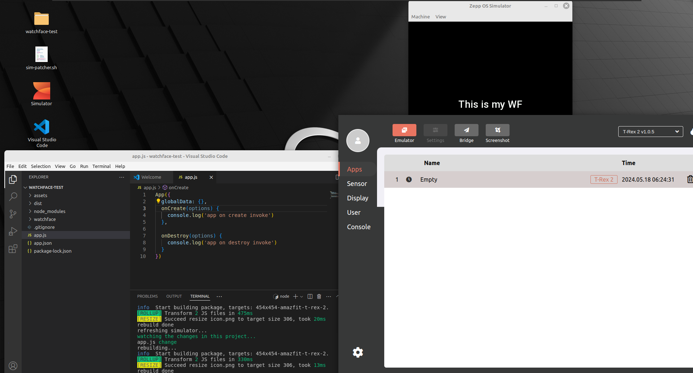

#### ZeppOS Simulator VM
Out of the box Simulator with all the things preinstalled and set up

#### Requires
1. Download the [VMWare Player](https://www.vmware.com/products/workstation-player/workstation-player-evaluation.html.html)
2. Download the VM from the [Releases](../../releases) page
3. Extract the archive using [7Zip](https://www.7-zip.org/download.html)
4. Run the `VMWare Player` and add a new machine (folder that you have just extracted)
5. Run the `Simulator` and login
6. Download `Emulators`
7. Patch them by running the `sim-patcher.sh` located on the `Desktop`

#### Credentials
user: sim 
pass: sim